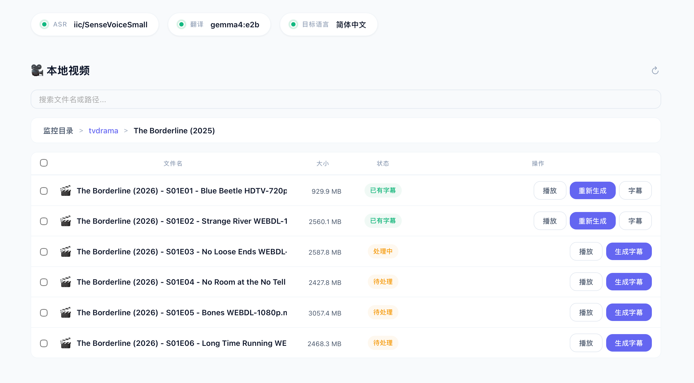
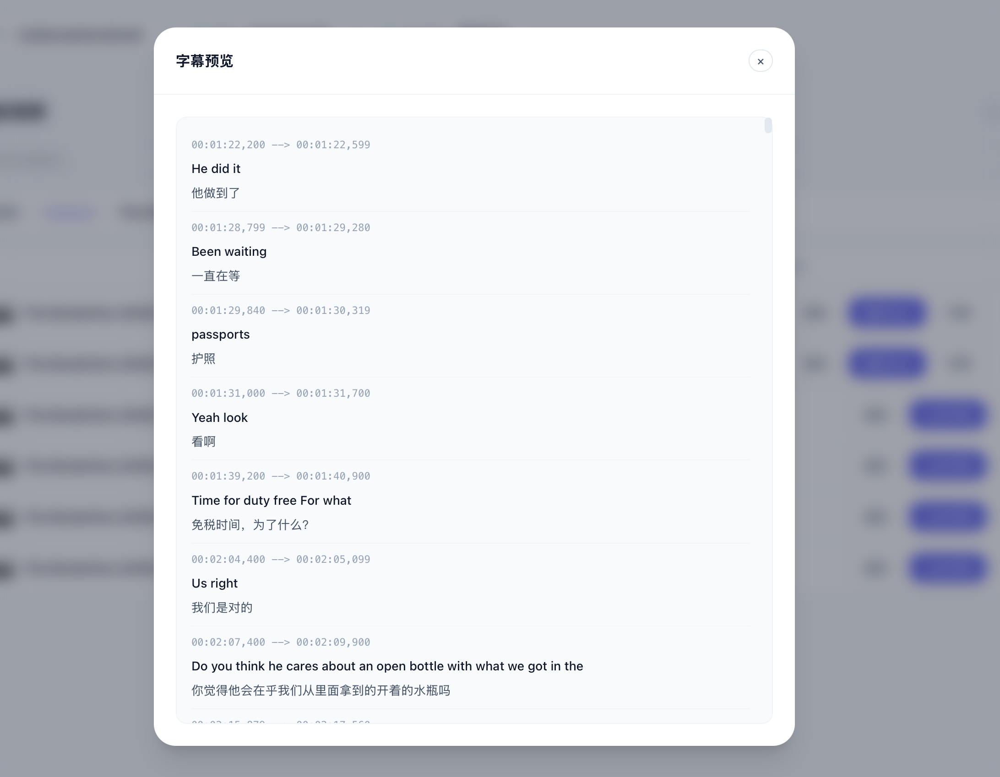
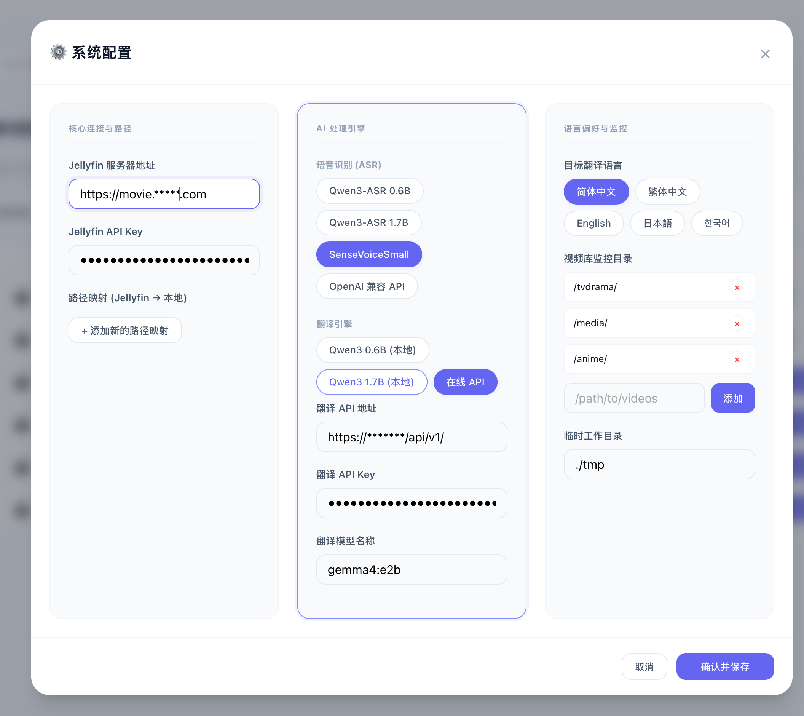
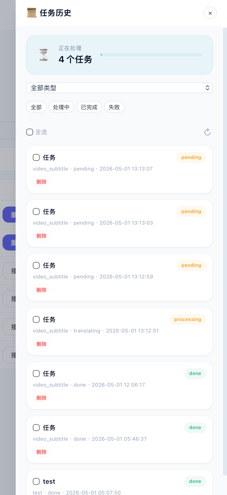
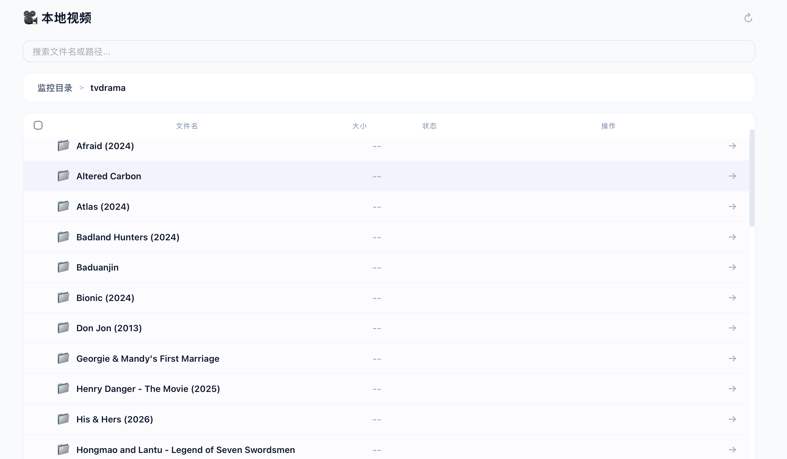

# JellySub-AI

Jellyfin 自动化 AI 字幕生成旁路服务。

## 界面预览

| 本地视频列表 | 字幕预览 |
|:---:|:---:|
|  |  |

| 系统配置 | 任务历史 |
|:---:|:---:|
|  |  |

| 本地视频目录 |
|:---:|
|  |

## 功能

### 模式一：Webhook 自动触发 (待测试)

当 Jellyfin 有新媒体入库时，通过 Webhook 通知本服务，自动完成：

1. 检查是否已有中文字幕（含 UTF-8 编码校验）
2. 使用 FFmpeg 提取音频
3. 使用 Qwen3-ASR 进行语音识别
4. 使用大模型 API 翻译为目标语言
5. 生成标准 SRT 字幕并通知 Jellyfin 刷新

### 模式二：本地视频手动扫描

1. 在配置页面添加本地视频目录路径
2. 服务自动递归扫描视频文件（支持中文路径、含空格路径、最深 5 级子目录）
3. 在 WebUI 中选择单个或批量视频生成字幕

## 技术栈

- **后端**: Python 3.10+ / FastAPI
- **前端**: 纯 HTML + JS + CSS（由 FastAPI 静态挂载）
- **音频处理**: FFmpeg (subprocess)
- **ASR**: ModelScope `Qwen/Qwen3-ASR-0.6B`
- **翻译**: OpenAI 兼容格式的大模型 API
- **依赖管理**: uv

## 快速开始

### 环境要求

- Python 3.10+
- [uv](https://docs.astral.sh/uv/) 包管理器
- FFmpeg / ffprobe（系统路径中可用）

### 安装依赖

```bash
uv sync
```

### 启动服务

```bash
uv run uvicorn main:app --host 0.0.0.0 --port 8000
```

访问 `http://localhost:8000/` 打开配置页面。

### 配置 Jellyfin Webhook

#### 1. 安装 Jellyfin Webhook 插件

在 Jellyfin 仪表盘中进入 **插件 → 目录**，搜索并安装 **Webhook** 插件，安装后重启 Jellyfin。

#### 2. 添加通知目标

进入 **仪表板 → 插件 → Webhook → 添加**，配置如下：

| 配置项             | 值                                               |
|-------------------|--------------------------------------------------|
| **名称**           | JellySub-AI（随意填写）                           |
| **Webhook 类型**   | `Generic Webhook`                                |
| **Enabled**        | ✅ 勾选                                            |
| **URI**            | `http://<jellysub-ai服务IP>:8000/webhook`         |
| **Method**         | `POST`                                           |
| **Format**         | `JSON`                                           |

#### 3. 配置签名校验（推荐）

Jellyfin Webhook 发送方必须通过 `X-Jellyfin-Signature` 请求头发送签名。本服务使用请求原始 body 的 HMAC-SHA256 验证来源，防止未授权调用。

**步骤：**

1. **生成并保存一个随机共享密钥**：
   ```bash
   export WEBHOOK_SECRET="$(openssl rand -hex 32)"
   printf 'WEBHOOK_SECRET=%s\n' "$WEBHOOK_SECRET" >> .env
   ```
2. **在 Jellyfin Webhook 插件或中间发送器中**配置同一密钥，并令其针对每次请求计算：
   ```bash
   HMAC-SHA256(WEBHOOK_SECRET, raw_request_body)
   ```
   将 64 位小写十六进制结果写入 `X-Jellyfin-Signature`。该值取决于每次请求的原始 body，不能配置为固定的 Custom Header。

**校验原理：** 本服务在解析 JSON 前计算 `HMAC-SHA256(WEBHOOK_SECRET, raw_request_body)`，并使用恒定时间比较与请求头中的签名核对。

> **注意：** 如果 `WEBHOOK_SECRET` 为空（默认），Webhook 端点会被禁用并返回 HTTP 503。

#### 4. 配置触发事件

在 Webhook 插件的 **Triggers** 选项卡中，添加以下触发条件：

| 触发事件            | 说明                           |
|--------------------|--------------------------------|
| `Item Added`       | 新媒体文件入库时触发（**必需**）  |
| `Item Marked Played` | 播放时触发（可选）             |

通常只需配置 `Item Added`，这样每当有新视频入库时就会自动检查并生成字幕。

#### 5. 可选：自定义通知内容

Jellyfin Webhook 插件默认发送的 JSON payload 包含以下字段，本服务会自动解析：

```json
{
  "ItemType": "Movie",
  "ItemId": "abc123",
  "Name": "电影名称",
  "Path": "/media/movies/电影名称/电影名称.mkv",
  "ServerName": "MyJellyfin",
  "ServerUrl": "http://localhost:8096"
}
```

电视剧还会额外发送 `SeriesName`、`SeasonNumber00`、`EpisodeNumber00` 字段。本服务也兼容小写字段名（`item_id`、`path`、`item_type`）。

#### 6. 完整配置示例

以下是一个从密钥设置到 Jellyfin 配置的完整流程：

```bash
# --- 第一步：生成随机密钥并写入 .env ---
export WEBHOOK_SECRET="$(openssl rand -hex 32)"
printf 'WEBHOOK_SECRET=%s\n' "$WEBHOOK_SECRET" >> .env

# --- 第二步：重启本服务 ---
uv run uvicorn main:app --host 0.0.0.0 --port 8000
```

然后在支持 HMAC-SHA256 body 签名的 Jellyfin Webhook 发送方中配置 `$WEBHOOK_SECRET`。如果所用插件不支持动态 body 签名，需要通过支持该签名方式的中间发送器转发，固定 Header 无法通过校验。

#### 7. Webhook 响应说明

本服务收到请求后会返回以下状态之一：

| 响应                                  | 含义                                   |
|--------------------------------------|----------------------------------------|
| `{"status": "accepted", "item": "..."}` | 任务已创建，开始处理                      |
| `{"status": "skipped", "reason": "unsupported type"}` | 非视频类型（音乐、图片等），跳过 |
| `{"status": "skipped", "reason": "subtitle already exists"}` | 已有有效中文字幕，跳过 |
| `{"status": "skipped", "reason": "internal subtitle"}` | 视频自带内置字幕，跳过 |
| HTTP 401 `{"detail": "Invalid webhook signature"}` | 签名校验失败，请检查 `WEBHOOK_SECRET` 和原始 body |
| HTTP 503 `{"detail": "Webhook secret is not configured"}` | 未配置密钥，端点已禁用 |
| `{"status": "error", "reason": "missing Path or ItemId"}` | 请求缺少必要字段 |

### 本地视频扫描

在配置页面（`http://localhost:8000/`）中设置 **视频目录**（`video_dirs`），添加你存放视频的本地路径。服务会自动扫描这些目录中的视频文件。

**扫描特性：**

- **支持格式**: mp4、mkv、avi、mov、wmv、flv、webm
- **中文路径**: 完全支持文件名和目录名包含中文
- **含空格路径**: 路径中包含空格也能正常解析
- **递归子目录**: 自动深入子目录查找视频（默认最深 5 级），例如：
  ```
  /data/movies/
    ├── Movie A/
    │   └── Movie A (2024).mkv          ← 扫描到
    └── Series B/
        ├── Season 1/
        │   ├── S01E01.mp4              ← 扫描到
        │   └── S01E02.mp4              ← 扫描到
        └── Season 2/                   ← 超过 5 级则不再深入
  ```

扫描结果会通过 `GET /api/videos` 接口返回，你可以在 WebUI 中查看并选择单个或批量生成字幕。

### 路径映射

如果 Jellyfin 和本服务运行在不同的容器或路径下，需在配置页面设置路径映射：

```
/media → /mnt/data
```

表示 Jellyfin 报告的 `/media/movie.mp4` 实际对应本地的 `/mnt/data/movie.mp4`。

## 项目结构

```
JellySub-AI/
├── main.py              # FastAPI 入口，Webhook 路由 + 后台任务
├── config.py            # 配置模型 + JSON 读写
├── pyproject.toml       # uv 依赖管理
├── core/
│   ├── audio.py         # FFmpeg 音频提取 + ffprobe 字幕流检查
│   ├── asr.py           # Qwen3-ASR 推理（自动检测 GPU）
│   ├── translate.py     # 大模型翻译字幕（严格锁定时间轴）
│   ├── jellyfin_api.py  # Jellyfin REST API 客户端
│   ├── subtitle_checker.py  # 已有字幕检查 + UTF-8 校验
│   └── subtitle_writer.py   # SRT 文件生成（UTF-8）
├── static/
│   ├── index.html       # WebUI 配置页
│   └── style.css        # 样式
└── tests/               # 测试用例
```

## 运行测试

```bash
uv run pytest -v
```

## VAD 与识别完整度调优

识别不全（尤其小声/低 SNR 对白）通常由 VAD 漏检引起，可通过 `config.json` 调整：

| 参数 | 默认 | 说明 |
|---|---|---|
| `vad_threshold` | 0.3 | Silero 语音概率阈值，越低越敏感（默认 0.5 会漏小声语音） |
| `vad_speech_pad_ms` | 300 | 语音段 padding，保住词首词尾 |
| `vad_min_silence_ms` | 500 | 最小静音，控制切分粒度 |
| `vad_min_speech_ms` | 100 | 最小语音时长，过滤瞬态噪声 |
| `audio_normalize` | true | 提取时 loudnorm 响度归一化，把小声对白拉到正常电平 |
| `max_subtitle_sec` | 7.0 | 单条字幕最大时长，超限按标点重切、时间按字符比例分配 |

工作方式：VAD 零检出时自动以更低阈值（`vad_threshold × 0.6`）重扫一次，避免静默放弃；
切块提取带 0.3s padding 防止硬切丢词首词尾。全部参数可经 WebUI 配置保存。

诊断：`GET /api/asr/diagnostics` 返回各引擎时间戳统计（`sensevoice.none` 占比高说明
字幕时间轴大量退回估算，可优先排查 ASR 版本或回退到 Qwen3-ASR）。

## API 端点

| 方法     | 路径            | 说明                  |
|--------|---------------|---------------------|
| `GET`  | `/`           | 配置页面                |
| `POST` | `/webhook`    | 接收 Jellyfin Webhook |
| `GET`  | `/api/config` | 获取当前配置              |
| `PUT`  | `/api/config` | 保存配置                |
| `GET`  | `/api/videos/subtitle/sources` | 列出视频可用的字幕来源（外部字幕文件 + 内置字幕流） |
| `GET`  | `/static/*`   | 静态资源                |

### 从已有字幕翻译（比 ASR 更准确）

在 WebUI 中选择视频生成字幕时，可在弹窗里切换「字幕来源」：

- **语音识别 (ASR)**：默认方式，从音频识别文本再翻译。
- **已有字幕翻译**：直接以视频旁已有的字幕文件（`.srt`/`.vtt`/`.ass`）或 MKV/MP4
  内置字幕流作为**文本来源**，跳过语音识别，翻译结果通常更准确且时间轴与原文完全一致。

单个视频生成时可从下拉列表里选择具体用哪个字幕来源；批量生成时每个视频自动选用
已有字幕，没有可用字幕的视频自动回退到 ASR 模式。

翻译时会先判定/选择**源语言**：选择字幕来源后自动识别其语言并在「源语言」
下拉框预填，用户也可以手动改成其它语言；忘记选择时默认「自动检测」，由服务对
字幕内容做脚本/常见词识别。请求体新增可选字段：

```json
{
  "video_path": "/path/to/movie.mkv",
  "source_type": "subtitle",            // "asr" | "subtitle"
  "subtitle_path": "/path/to/movie.en.srt",  // source_type=subtitle 时可选（外部文件）
  "subtitle_index": 1,                         // 或指定内置字幕流索引
  "source_lang": "auto"                       // 源语言；auto=自动识别，也可填 en/zh/ja/ko/fr/de/es/it/pt/ru/ar 等
}
```

## 开发

```bash
# 安装开发依赖
uv sync

# 运行测试
uv run pytest -v

# 启动开发服务器（自动重载）
uv run uvicorn main:app --host 0.0.0.0 --port 8000 --reload
```

### Docker如何运行

由于涉及模型、数据库和环境变量，建议使用以下方式运行：

> 在线镜像： ghcr.io/kekxv/jellysub-ai:main

#### 方案 A：Docker Run (快速测试)

```bash
docker build -t jellysub-ai .

# 交互输入用户名，并为本次部署生成不可预测的密码和 session 密钥
read -rp "Admin username: " ADMIN_USERNAME
export ADMIN_USERNAME
export ADMIN_PASSWORD="$(openssl rand -base64 24)"
export SESSION_SECRET="$(openssl rand -hex 32)"

docker run -d -p 8000:8000 \
  -e ADMIN_USERNAME \
  -e ADMIN_PASSWORD \
  -e SESSION_SECRET \
  -e SESSION_HTTPS_ONLY=true \
  -e HOME=/data \
  -e MODEL_SOURCE="modelscope" \
  -v jellysub-data:/data \
  --name jellysub jellysub-ai
```

CPU 和 GPU 容器都以固定的非 root 身份 `app`（UID/GID `10001:10001`）运行。配置文件、任务数据库、临时音频和模型缓存统一保存在 `/data`；使用命名卷可避免把凭据写入镜像，并在容器升级后保留运行时状态。使用 bind mount 时，宿主机上的 `/data` 目录和需要写入字幕的媒体目录必须允许 `10001:10001` 写入（例如 `sudo chown -R 10001:10001 /path/to/data /path/to/media`），这样 CPU/GPU 镜像切换时权限保持兼容。

#### 方案 B：Docker Compose (推荐)

创建 `docker-compose.yml`：

```yaml
services:
  jellysub:
    build: .
    ports:
      - "8000:8000"
    environment:
      ADMIN_USERNAME: ${ADMIN_USERNAME:?Set ADMIN_USERNAME}
      ADMIN_PASSWORD: ${ADMIN_PASSWORD:?Set ADMIN_PASSWORD}
      SESSION_SECRET: ${SESSION_SECRET:?Set SESSION_SECRET}
      SESSION_HTTPS_ONLY: "true"
      # ModelScope 会在 $HOME/.modelscope 保存会话信息；镜像中的 app
      # 用户没有 /home/app，因此必须指向可写的持久化目录。
      HOME: /data
      MODEL_SOURCE: modelscope
      MODEL_IDLE_TIMEOUT: "300"
    volumes:
      - jellysub-data:/data
    restart: always

volumes:
  jellysub-data:
```

### 使用宿主机目录、ModelScope 与 PVE CT

建议把运行时文件作为**整个目录**挂载到 `/data`，而不是分别挂载
`config.json` 或 `tasks.db`：配置保存采用原子替换，Docker 的单文件 bind
mount 无法被替换，会导致保存配置时报 `Device or resource busy`。SQLite
也需要在数据库所在目录创建 WAL/journal 文件。

```yaml
services:
  jellysub:
    environment:
      HOME: /data
      MODEL_SOURCE: modelscope
    volumes:
      - ./data/jellysub:/data
      # 可选：将大模型缓存放到独立磁盘。该目录也必须可写。
      - /data/movie/jellysub_model_cache:/data/model_cache
      - /data/movie/media:/media
```

镜像固定以 UID/GID `10001:10001` 运行，`PUID` 和 `PGID` 环境变量不会改变
这一点。因此 `./data/jellysub`、`jellysub_model_cache` 以及要写入字幕的媒体目录
都必须允许该 UID 写入。例如普通 Docker 宿主机可执行：

```bash
sudo chown -R 10001:10001 ./data/jellysub /data/movie/jellysub_model_cache
```

在 PVE **非特权 CT** 中，容器内 UID 会映射为 PVE 宿主机上的另一个 UID。先在
PVE 宿主机确认映射：

```bash
pct exec <CTID> -- cat /proc/self/uid_map
pct exec <CTID> -- cat /proc/self/gid_map
```

默认映射 `0 100000 65536` 时，应用 UID/GID `10001:10001` 对应 PVE 宿主机的
`110001:110001`；需要对 **PVE 宿主机上 bind mount 的实际源目录** 授权：

```bash
chown -R 110001:110001 /实际的PVE挂载源/jellysub_model_cache
```

若目录显示为 `nobody:nogroup`，或 ModelScope 提示无法写入
`model_cache/.lock`，说明映射后的 UID 没有写权限。修正整个模型缓存目录的所有者
或 ACL 后，再重启服务。
